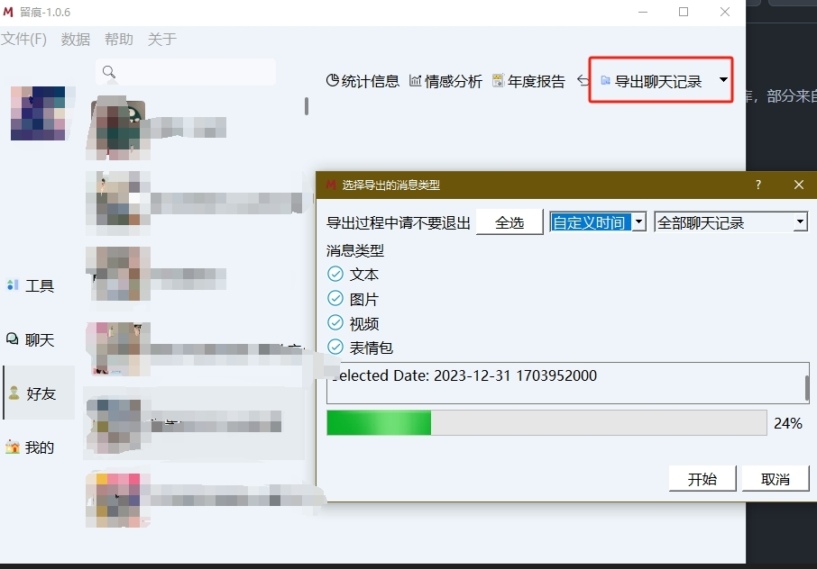

# README

> 使用脚本需要安装`python3`
>
> 用的是<https://github.com/LC044/WeChatMsg>提供的Windows微信数据库解密工具，这个工具只支持个人用户的年度总结，所以写了这个脚本。
>
> 本文件由ChatGPT 4编写，我只是负责复制粘贴

1. 下载<https://github.com/LC044/WeChatMsg/releases/download/v1.0.6/MemoTrace-1.0.6.exe>
2. 打开`MemoTrace.exe`软件，按照要求解密数据库
3. 重启后点击左侧的好友按钮，选择群组，点击上面的导出聊天记录，选择`csv`格式导出
4. 可以一次导出多个群的聊天记录，脚本会自动搜索目录下所有的聊天记录进行分析
5. 打开命令行，运行`pip install -r requirements.txt`
6. 打开命令行，运行`python wechat_report.py`